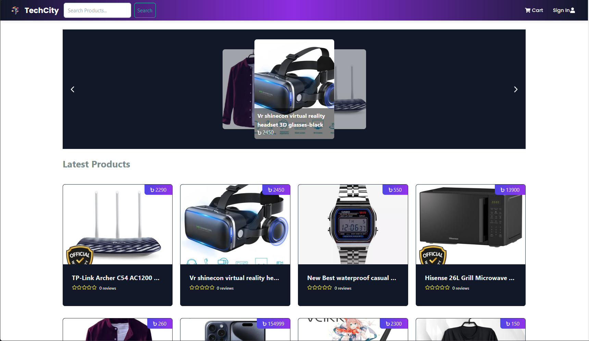

# Tech City eCommerce Platform

An eCommerce platform built with the MERN stack and Redux, featuring a complete shopping cart system and integration with the SSLCOMMERZ payment gateway with three actors: customer, seller and admin.

# Image Slider for Project Screenshots

<div style="text-align: center;">
  
  <br><br>
  <button id="prevButton" onclick="previousImage()" style="background-color: #f0f0f0; border: none; padding: 10px 20px; cursor: pointer; border-radius: 5px; margin-right: 10px; box-shadow: 0px 4px 6px rgba(0, 0, 0, 0.1);">Previous</button>

<button id="nextButton" onclick="nextImage()" style="background-color: #f0f0f0; border: none; padding: 10px 20px; cursor: pointer; border-radius: 5px; box-shadow: 0px 4px 6px rgba(0, 0, 0, 0.1);">Next</button>
</div>

<script>
  let images = [
    "docs/Screenshot_1.png", 
    "docs/Screenshot_2.png", 
    "docs/Screenshot_3.png", 
    "docs/Screenshot_4.png", 
    "docs/Screenshot_5.png", 
    "docs/Screenshot_6.png"
  ];
  let currentIndex = 0;

  function nextImage() {
    currentIndex = (currentIndex + 1) % images.length;
    document.getElementById("slideImage").src = images[currentIndex];
  }

  function previousImage() {
    currentIndex = (currentIndex - 1 + images.length) % images.length;
    document.getElementById("slideImage").src = images[currentIndex];
  }
</script>

## Features:

➡️ Full featured shopping cart

➡️ Product reviews and ratings

➡️ Top products carousel

➡️ Product pagination

➡️ Product search feature

➡️ User profile with orders

➡️ Admin product management

➡️ Admin user management

➡️ Admin Order details page

➡️ Mark orders as delivered option

➡️ Checkout process (shipping, payment method, etc.)

➡️ SSLCOMMERZ integration

➡️ Database seeder (products & users)


## Env Variables

Rename the `.env.example` file to `.env` and add the following

```makefile
PORT=5000
NODE_ENV=production
MONGODB_URI=""
JWT_SECRET=abc123
STORE_ID=""
STORE_PASS=""
BASE_URL=http://localhost:5000
FRONTEND_URL=http://localhost:3000
REACT_APP_API_URL=http://localhost:3000
```


## Steps to install the App in you local machine


```npm install
npm install
cd frontend
npm install
```

Run

```
# Run frontend at 3000 PORT & backend 5000 PORT
npm run dev

# Run just backend
npm run server
```

Build & Deploy

```
# Create frontend prod build
cd frontend
npm run build
```


## Sample User Login:

Admin

* Id: admin@email.com
* Password: 123456

Seller:

* Id: rizvi999@gmail.com
* Password: V*nIE9Ko&9M%tn

User:

* Id: user1@gmail.com
* Password: V*nIE9Ko&9M%tm