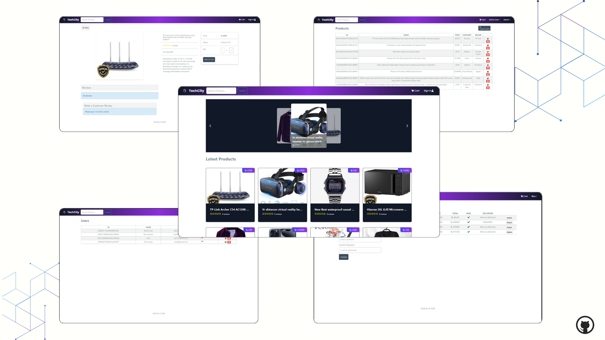

# 🏙️ Tech City eCommerce Platform

An eCommerce platform built with the MERN stack and Redux, featuring a complete shopping cart system and integration with the SSLCOMMERZ payment gateway with three actors: customer, seller and admin.

---



## ✨ Features:

* Full featured shopping cart

* Product reviews and ratings

* Top products carousel

* Product pagination

* Product search feature

* User profile with orders

* Admin product management

* Admin user management

* Admin Order details page

* Mark orders as delivered option

* Checkout process (shipping, payment method, etc.)

* SSLCOMMERZ integration

* Database seeder (products & users)


## ⚙️ Env Variables

Rename the `.env.example` file to `.env` and add the following

```makefile
PORT=5000
NODE_ENV=production
MONGODB_URI=""
JWT_SECRET=abc123
STORE_ID=""
STORE_PASS=""
BASE_URL=http://localhost:5000
FRONTEND_URL=http://localhost:3000
REACT_APP_API_URL=http://localhost:3000
```


## 🛠️ Steps to install the App in you local machine


```npm install
npm install
cd frontend
npm install
```

Run

```
# Run frontend at 3000 PORT & backend 5000 PORT
npm run dev

# Run just backend
npm run server
```

Build & Deploy

```
# Create frontend prod build
cd frontend
npm run build
```


## 🔑 Sample User Login:

Admin

* Id: admin@email.com
* Password: 123456

Seller:

* Id: rizvi999@gmail.com
* Password: V*nIE9Ko&9M%tn

User:

* Id: user1@gmail.com
* Password: V*nIE9Ko&9M%tm